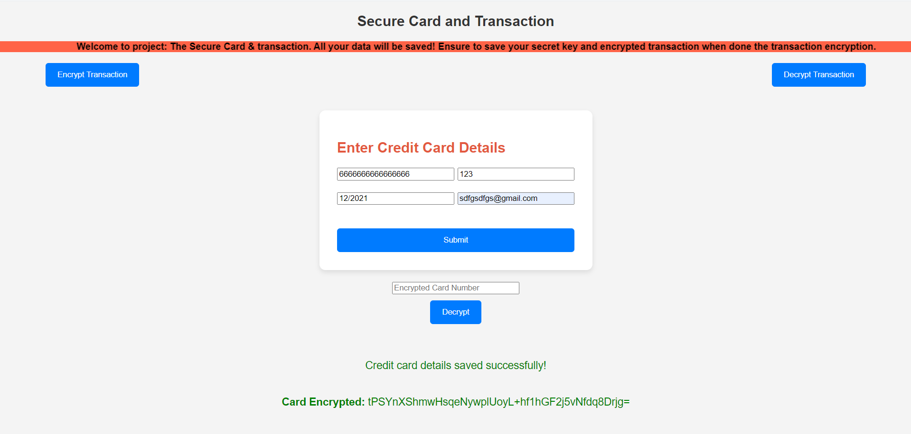

# SecureCreditCard 

SecureCreditCard is a Java application designed to encrypt credit card details using Advanced Encryption Standard (AES) encryption and store them securely in an Amazon Web Services Relational Database Service (AWS RDS). This application provides a secure and reliable solution for storing sensitive credit card information while ensuring data confidentiality and integrity.

## Key Features

- **AES Encryption:** SecureCreditCard employs AES encryption to securely encrypt credit card details before storing them in the database. AES is a widely recognized and trusted encryption algorithm that provides strong security for sensitive data.
  
- **AWS RDS Integration:** The application seamlessly integrates with Amazon RDS, a managed relational database service provided by AWS. By leveraging AWS RDS, SecureCreditCard ensures data durability, high availability, and scalability of the underlying database infrastructure.
  
- **User-friendly Interface:** SecureCreditCard offers a user-friendly interface for encrypting and storing credit card details. Users can input their credit card information through a web interface or API, and the application handles the encryption and storage process transparently.
  
- **Secure Data Storage:** Encrypted credit card details are securely stored in the AWS RDS database, ensuring that sensitive information is protected from unauthorized access or tampering. AWS RDS provides features such as data encryption at rest and in transit to enhance data security.
  
- **Scalability and Performance:** The application is designed to scale efficiently to accommodate growing volumes of credit card data. AWS RDS offers scalable compute and storage resources, allowing the application to handle increased workload demands without compromising performance.
  
- **Compliance and Regulation:** SecureCreditCard adheres to industry best practices and compliance standards for handling sensitive financial data, such as PCI DSS (Payment Card Industry Data Security Standard). By using strong encryption and secure storage mechanisms, the application helps organizations meet regulatory requirements and maintain data compliance.
  
- **Open Source:** SecureCreditCard is an open-source project hosted on GitHub, allowing developers to contribute, review, and improve the codebase collaboratively. Contributions from the community help enhance the security, reliability, and functionality of the application.

## Getting Started

To use SecureCreditCard, follow these steps:

1. Clone the GitHub repository to your local machine.
2. Configure the AWS RDS database credentials and connection settings in the application configuration file.
3. Build and deploy the application to your preferred environment (e.g., AWS EC2 instance, local server).
4. Access the application through the provided web interface or API endpoints to encrypt and store credit card details securely.

## Contributing

We welcome contributions from the community to help improve SecureCreditCard. Whether it's fixing bugs, adding new features, or enhancing security, your contributions are valuable in making the application better for everyone. Please review the contribution guidelines in the GitHub repository and submit your pull requests to get involved.

## Security Notice

While SecureCreditCard aims to provide robust security for credit card data, it is essential to follow best practices for securing sensitive information. Please review and implement security measures appropriate for your deployment environment to mitigate risks and protect data privacy.

For any questions, feedback, or support requests, please [contact us](mailto:thechampthapa@gmail.com).
